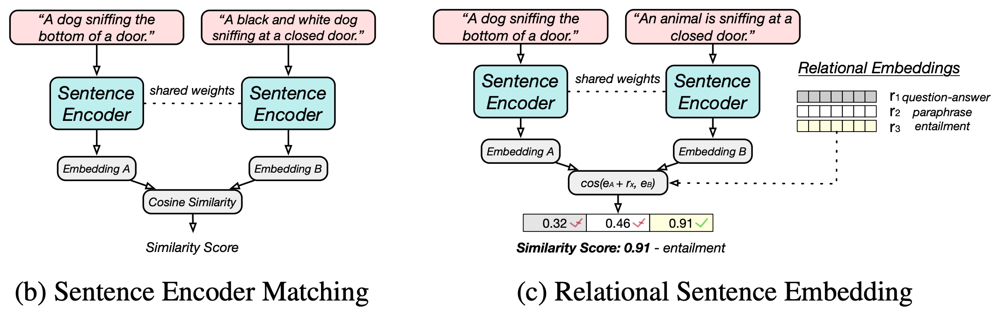
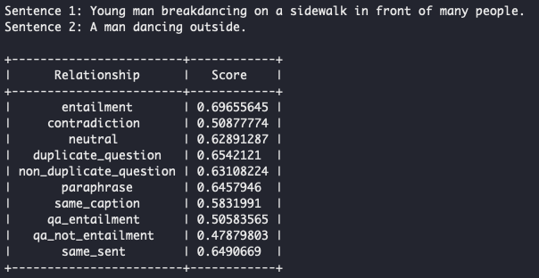

## RSE: Relational Sentence Embedding for Flexible Semantic Matching

[](https://github.com/BinWang28/RSE)

[](https://arxiv.org/abs/2212.08802)

This repository contains the code for our paper: 
[Relational Sentence Embedding for Flexible Semantic Matching](https://arxiv.org/abs/2212.08802).

****
- **Feb. 20, 2023**: We released the complete checkpoints and their evaluation scripts on a wide range of tasks.
- **Feb. 13, 2023**: We released our first [checkpoint](demo/) and inference [demo](demo/). Check it out.
- **Dec. 17, 2022**: Our paper is available online: [RSE Paper](https://arxiv.org/abs/2212.08802).

****


### Outline

- [RSE: Relational Sentence Embedding for Flexible Semantic Matching](#rse-relational-sentence-embedding-for-flexible-semantic-matching)
  - [Outline](#outline)
- [Overview](#overview)
- [Getting Started](#getting-started)
  - [Step 1: Environment Setup](#step-1-environment-setup)
  - [Step 2: Inference Demo](#step-2-inference-demo)
- [Model List](#model-list)
- [Evaluation-Only](#evaluation-only)
  - [STS Tasks](#sts-tasks)
  - [USEB Tasks](#useb-tasks)
  - [Transfer Tasks](#transfer-tasks)
  - [EvalRank Tasks](#evalrank-tasks)
- [Training, Inference, and Evaluation](#training-inference-and-evaluation)
  - [Data Preparation](#data-preparation)
  - [Training](#training)
- [Citation](#citation)


## Overview

We propose a new sentence embedding paradigm to further discover the potential of sentence embeddings. Previous sentence embedding learns on vector representation for each sentence and no relation information is incorporated. Here, in RSE, the sentence relations are explicitly modelled. During inference, we can obtain sentence similarity for each relation type. The `relational similarity score` can be flexible used for sentence embedding applications like clustering, ranking, similarity modeling, and retrieval.

We believe the `Relational Sentence Embedding` has great potential in developing new models as well as applications.

<p align="center">

</p>


## Getting Started

### Step 1: Environment Setup

**Step-by-step Environment Setup**: We provide step-by-step environment [setup](environment/README.md).

**One-line Environment Setup**: An easy one-line environment [setup](environment/README.md) (maybe harder to debug). TODO: update

### Step 2: Inference Demo

After environment setup, we can process with the inference demo. The trained model will be automatically downloaded through Huggingface.
  
```
bash scripts/demo_inference_local.sh
```

<p align="center">

</p>

- **Analysis**: We can see that the highest relational similarity score between the above two sentences is **entailment**. Meantime, you get scores with any relations, this can be used flexiblely for various tasks.

- To choose other models: 
  
    ```
    --model_name_or_path binwang/RSE-BERT-base-10-relations
    --model_name_or_path binwang/RSE-BERT-large-10-relations
    --model_name_or_path binwang/RSE-RoBERTa-base-10-relations
    --model_name_or_path binwang/RSE-RoBERTa-large-10-relations
    ```

## Model List

Here are our provided model checkpoints, all available on Huggingface.

<div align="center">

| Model | Description |
|-|-|
| [binwang/RSE-BERT-base-10-relations](https://huggingface.co/binwang/RSE-BERT-base-10-relations) | all 10 relations, for demo |
| [binwang/RSE-BERT-large-10-relations](https://huggingface.co/binwang/RSE-BERT-large-10-relations) | all 10 relations, for demo |
| [binwang/RSE-RoBERTa-base-10-relations](https://huggingface.co/binwang/RSE-RoBERTa-base-10-relations) | all 10 relations, for demo |
| [binwang/RSE-RoBERTa-large-10-relations](https://huggingface.co/binwang/RSE-RoBERTa-large-10-relations) | all 10 relations, for demo |
|-|-|
| [binwang/RSE-BERT-base-STS](https://huggingface.co/binwang/RSE-BERT-base-STS) | BERT-base for STS task |
| [binwang/RSE-BERT-large-STS](https://huggingface.co/binwang/RSE-BERT-large-STS) | BERT-large for STS task |
| [binwang/RSE-RoBERTa-base-STS](https://huggingface.co/binwang/RSE-RoBERTa-base-STS) | RoBERTa-base for STS task |
| [binwang/RSE-RoBERTa-large-STS](https://huggingface.co/binwang/RSE-RoBERTa-large-STS) | RoBERTa-large for STS task |
|-|-|
| [binwang/RSE-BERT-base-USEB](https://huggingface.co/binwang/RSE-BERT-base-USEB) | BERT-base for USEB task |
| [binwang/RSE-BERT-large-USEB](https://huggingface.co/binwang/RSE-BERT-large-USEB) | BERT-large for USEB task |
| [binwang/RSE-RoBERTa-base-USEB](https://huggingface.co/binwang/RSE-RoBERTa-base-USEB) | RoBERTa-base for USEB task |
| [binwang/RSE-RoBERTa-large-USEB](https://huggingface.co/binwang/RSE-RoBERTa-large-USEB) | RoBERTa-large for USEB task |
|-|-|
| [binwang/RSE-BERT-base-Transfer](https://huggingface.co/binwang/RSE-BERT-base-Transfer) | BERT-base for Transfer task |
| [binwang/RSE-BERT-large-Transfer](https://huggingface.co/binwang/RSE-BERT-large-Transfer) | BERT-large for Transfer task |
| [binwang/RSE-RoBERTa-base-Transfer](https://huggingface.co/binwang/RSE-RoBERTa-base-Transfer) | RoBERTa-base for Transfer task |
| [binwang/RSE-RoBERTa-large-Transfer](https://huggingface.co/binwang/RSE-RoBERTa-large-Transfer) | RoBERTa-large for Transfer task |
|-|-|
| [More to update](https://huggingface.co/binwang/) | Full list of models |

</div>

## Evaluation-Only

We include the evaluation with (1) STS tasks, (2) Transfer tasks, (3) EvalRank, and (4) USEB tasks.

### STS Tasks

- Download STS datasets first

```
cd rse_src/SentEval/data/downstream/
bash download_RSE_SentEval_data.sh
```

- To reproduce the evaluation on STS (`RSE-BERT-base-STS` as am example, run in the main folder)

```
bash scripts/demo_inference_STS.sh
```

It is same with:
```
accelerate launch --config_file accelerate_config.yaml --num_cpu_threads_per_process 10 \
    rse_src/inference_eval.py \
        --model_name_or_path binwang/RSE-BERT-base-STS \
        --mode RSE \
        --rel_types entailment duplicate_question \
        --sim_func 1.0 0.5 \
        --cache_dir scripts/model_cache/cache \
        --pooler_type cls \
        --max_seq_length 32 \
        --metric_for_eval STS
```

The expected results:
```
+-------+-------+-------+-------+-------+--------------+-----------------+-------+
| STS12 | STS13 | STS14 | STS15 | STS16 | STSBenchmark | SICKRelatedness |  Avg. |
+-------+-------+-------+-------+-------+--------------+-----------------+-------+
| 76.27 | 84.43 | 80.60 | 86.03 | 81.86 |    84.34     |      81.73      | 82.18 |
+-------+-------+-------+-------+-------+--------------+-----------------+-------+
```

Explaination of the arguments of evaluation code (in `scripts/demo_inference_STS.sh`):

`--model_name_or_path`: The model to be loaded for evaluation. We provide a serious of models and their performance comparison.

`--rel_types`: The relations to be used in the current model. It should match the number of relations and their order during training. In the above example, two relations are used in training `entailment` and `duplicate_question`.

`--sim_func`: The weights for each relation when computing the final weights. As we have multiple relational scores, the argument is the weight for weighted sum to calcuate the final score between two sentences. It can be flexibly adjusted for different applications.

`--metric_for_eval`: Current evaluation tasks. Can be `STS`, `USEB`, `Transfer` or `EvalRank`.

Performance of other models (simply change `model_name_or_path` argument):

```
+-------------------------------+----------+
| Model                         | Avg. STS | 
+-------------------------------+----------+
| binwang/RSE-BERT-base-STS     | 82.18    | 
+-------------------------------+----------+
| binwang/RSE-BERT-large-STS    | 83.42    | 
+-------------------------------+----------+
| binwang/RSE-RoBERTa-base-STS  | 82.71    | 
+-------------------------------+----------+
| binwang/RSE-RoBERTa-large-STS | 84.41    | 
+-------------------------------+----------+
```

Performance on "STR" [dataset](https://arxiv.org/abs/2110.04845):
```
+-------------------------------+----------+
| Model                         | STR      | 
+-------------------------------+----------+
| binwang/RSE-BERT-base-STS     | 80.69    | 
+-------------------------------+----------+
| binwang/RSE-BERT-large-STS    | 81.98    | 
+-------------------------------+----------+
| binwang/RSE-RoBERTa-base-STS  | 81.50    | 
+-------------------------------+----------+
| binwang/RSE-RoBERTa-large-STS | 83.72    | 
+-------------------------------+----------+
```

### USEB Tasks

- Download USEB datasets
```
cd rse_src/useb/data/
bash download_USEB_data.sh
```
It will download and untar the datasets.

- To reproduce the evaluation on USEB (`RSE-BERT-base-USEB` as am example, run in the main folder)

```
bash scripts/demo_inference_USEB.sh
```

It is same with:
```
accelerate launch --config_file accelerate_config.yaml --num_cpu_threads_per_process 10 \
    rse_src/inference_eval.py \
        --model_name_or_path binwang/RSE-BERT-base-USEB \
        --mode RSE \
        --rel_types entailment duplicate_question paraphrase same_caption qa_entailment same_sent \
        --cache_dir scripts/model_cache/cache \
        --pooler_type cls \
        --max_seq_length 32 \
        --metric_for_eval USEB
```

The expected results:
```
+-----------+-------------+-------------+---------+-------+
| AskUbuntu | CQADupStack | TwitterPara | SciDocs | Avg.  | 
+-----------+-------------+-------------+---------+-------+
|   54.8    |    13.7     |    75.2     |  71.0   | 53.7  |
+-----------+-------------+-------------+---------+-------+
```

`--model_name_or_path`: The model to be loaded for evaluation. We provide a serious of models and their performance comparison.

Performance of other models (simply change `model_name_or_path` argument):

```
+--------------------------------+-----------+-------------+-------------+---------+-------+
| Model                          | AskUbuntu | CQADupStack | TwitterPara | SciDocs | Avg.  |
+--------------------------------+-----------+-------------+-------------+---------+-------+
| binwang/RSE-BERT-base-USEB     |   54.8    |    13.7     |    75.2     |  71.0   | 53.7  |
+--------------------------------+-----------+-------------+-------------+---------+-------+
| binwang/RSE-BERT-large-USEB    |   56.2    |    13.9     |    76.7     |  71.9   | 54.7  |
+--------------------------------+-----------+-------------+-------------+---------+-------+
| binwang/RSE-RoBERTa-base-USEB  |   56.2    |    13.3     |    74.8     |  69.7   | 53.5  |
+--------------------------------+-----------+-------------+-------------+---------+-------+
| binwang/RSE-RoBERTa-large-USEB |   58.0    |    15.2     |    77.5     |  72.4   | 55.8  |
+--------------------------------+-----------+-------------+-------------+---------+-------+
```


### Transfer Tasks

- No need to download data if you have done in `STS` section.

- To reproduce the evaluation on Transfer Tasks (`RSE-BERT-base-Transfer` as am example, run in the main folder)

```
bash scripts/demo_inference_Transfer.sh
```

It is same with:
```
accelerate launch --config_file accelerate_config.yaml --num_cpu_threads_per_process 10 \
    rse_src/inference_eval.py \
        --model_name_or_path binwang/RSE-RoBERTa-large-Transfer \
        --mode RSE \
        --rel_types entailment paraphrase \
        --cache_dir scripts/model_cache/cache \
        --pooler_type cls \
        --max_seq_length 32 \
        --layer_aggregation 5 \
        --metric_for_eval transfer_tasks
```

The expected results:
```
+-------+-------+-------+-------+-------+-------+-------+-------+
|  MR   |   CR  |  SUBJ |  MPQA |  SST2 |  TREC |  MPRC |  Avg. | 
+-------+-------+-------+-------+-------+-------+-------+-------+
| 82.34 | 88.98 | 95.33 | 90.60 | 88.36 | 93.00 | 77.39 | 88.00 |
+-------+-------+-------+-------+-------+-------+-------+-------+
```

`--model_name_or_path`: The model to be loaded for evaluation. We provide a serious of models and their performance comparison.

Performance of other models (simply change `model_name_or_path` argument):

```
+------------------------------------+-------+-------+-------+-------+-------+-------+-------+-------+
| Model                              |  MR   |   CR  |  SUBJ |  MPQA |  SST2 |  TREC |  MPRC |  Avg. | 
+------------------------------------+-------+-------+-------+-------+-------+-------+-------+-------+
| binwang/RSE-BERT-base-Transfer     | 82.34 | 88.98 | 95.33 | 90.60 | 88.36 | 93.00 | 77.39 | 88.00 |
+------------------------------------+-------+-------+-------+-------+-------+-------+-------+-------+
| binwang/RSE-BERT-large-Transfer    | 84.53 | 90.46 | 95.71 | 90.51 | 90.17 | 95.20 | 76.70 | 89.04 |
+------------------------------------+-------+-------+-------+-------+-------+-------+-------+-------+
| binwang/RSE-RoBERTa-base-Transfer  | 84.52 | 91.21 | 94.40 | 90.20 | 91.49 | 91.40 | 77.10 | 88.62 |
+------------------------------------+-------+-------+-------+-------+-------+-------+-------+-------+
| binwang/RSE-RoBERTa-large-Transfer | 86.28 | 91.21 | 95.18 | 91.16 | 91.43 | 95.40 | 78.20 | 89.84 |
+------------------------------------+-------+-------+-------+-------+-------+-------+-------+-------+
```


### EvalRank Tasks

TODO: xx


## Training, Inference, and Evaluation

### Data Preparation

Please download all seven [relational data](https://huggingface.co/datasets/binwang/RSE-sentence-relational-data) or necessary ones and place them in the './data' folder.
```
cd data/
bash download_relational_data.sh
```

### Training

TODO: Provide the whole training files (1) continue training (2) for STS Tasks (3) for Transfer Tasks (4) for USEB Tasks.


## Citation

Please cite our paper if you find RSE useful in your work.

```bibtex
@article{wang2022rse,
  title={Relational Sentence Embedding for Flexible Semantic Matching},
  author={Wang, Bin and Li, Haizhou},
  journal={arXiv preprint arXiv:2212.08802},
  year={2022}
}
```

Please contact Bin Wang @ bwang28c@gmail.com or raise an issue.