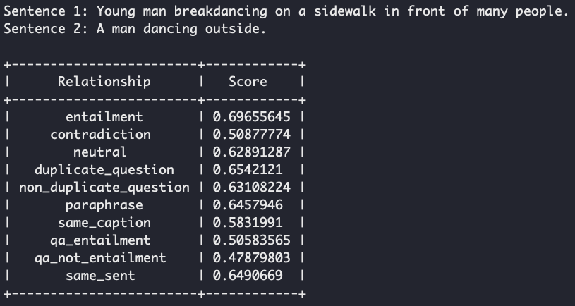

## RSE: Relational Sentence Embedding for Flexible Semantic Matching

This repository contains the code and demo for our paper: 
[Relational Sentence Embedding for Flexible Semantic Matching](https://arxiv.org/abs/2212.08802).

- **Feb. 13, 2023**: We released our first [checkpoint](demo/) and inference [demo](demo/). Check it out.
- **Dec. 17, 2022**: Our paper is available online: [RSE Paper](https://arxiv.org/abs/2212.08802).


### Outline

- [RSE: Relational Sentence Embedding for Flexible Semantic Matching](#rse-relational-sentence-embedding-for-flexible-semantic-matching)
  - [Outline](#outline)
- [Overview](#overview)
- [Getting Started](#getting-started)
  - [Step 1: Environment Setup](#step-1-environment-setup)
  - [Step 2: Inference Demo](#step-2-inference-demo)
- [Model List](#model-list)
- [Easy Demo with Pip](#easy-demo-with-pip)
- [Training, Inference and Evaluation](#training-inference-and-evaluation)
- [Citation](#citation)


## Overview

TODO: coming soon


## Getting Started

### Step 1: Environment Setup

**Step-by-step Environment Setup**: We provide step-by-step environment [setup](environment/README.md).

**One-line Environment Setup**: An easy one-line environment [setup](environment/README.md) (maybe harder to debug).

### Step 2: Inference Demo

After environment setup, we can process with the inference demo. The trained model will be automatically downloaded through Huggingface.

```
bash scripts/demo_inference_local.sh
```



- **Analysis**: We can see that the highest relational similarity score between the above two sentences is **entailment**. Meantime, you get scores with any relations, this can be used flexiblely for various tasks.


## Model List

Here are our provided model checkpoints, all available on Huggingface.

<div align="left">

| Model | Description |
|-|-|
| [binwang/RSE-BERT-base-10-relations](https://huggingface.co/binwang/RSE-BERT-base-10-relations) | for demo |

</div>

## Easy Demo with Pip

TODO: integrate the code and model with pypi


## Training, Inference and Evaluation

TODO: Provide the whole training files (1) continue training (2) for STS Tasks (3) for Transfer Tasks (4) for USEB Tasks.


## Citation

Please cite our paper if you find RSE useful in your work.

```bibtex
@article{wang2022rse,
  title={Relational Sentence Embedding for Flexible Semantic Matching},
  author={Wang, Bin and Li, Haizhou},
  journal={arXiv preprint arXiv:2212.08802},
  year={2022}
}
```

Please contact Bin Wang @ bwang28c@gmail.com or raise an issue.