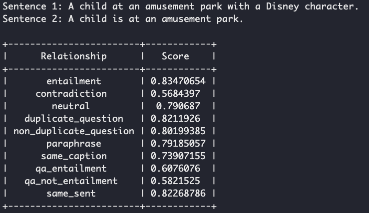
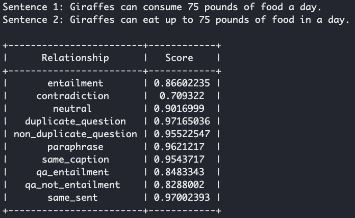
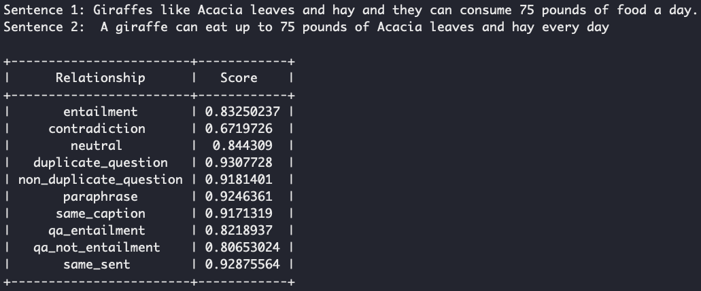
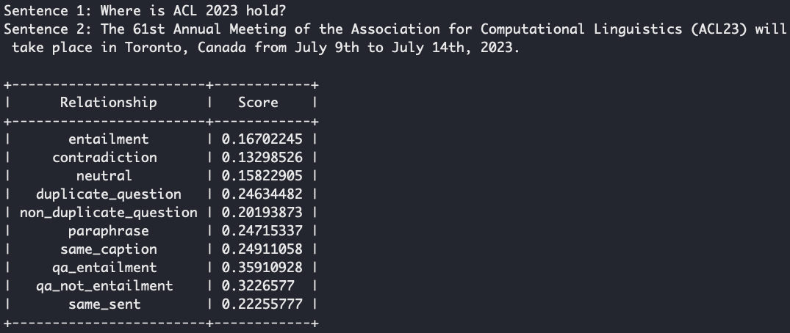
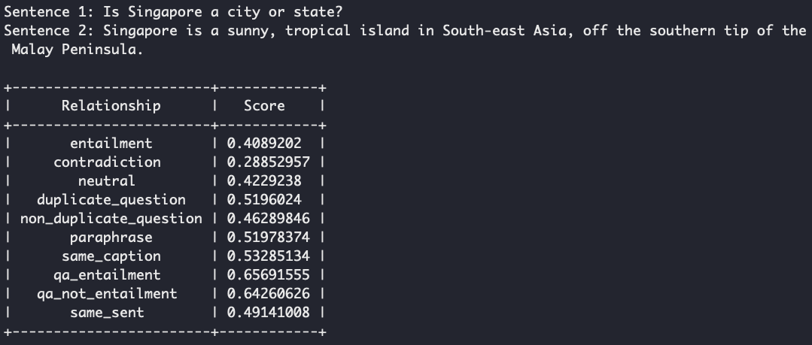

## Demo Page

We provide several demo examples for different models.

## Outline

- [Demo Page](#demo-page)
- [Outline](#outline)
  - [RSE-BERT-based-10-rel](#rse-bert-based-10-rel)


### RSE-BERT-based-10-rel

The RSE-BERT-base-10-rel is trained with 10 relations including (1) entailment (2) contradiction (3) neutral (4) duplicate_question (5) non_duplicate_question (6) paraphrase (7) same_caption (8) qa_entailment (9) qa_not_entailment (10) same_sent 

To duplicate the demo (run in the root directory):
```
bash scripts/demo_inference_local.sh
```

- **Case 1:** Two sentences has the most highest score for 'entailment'.


- **Case 2:** Two sentence has the most highest score for 'same sent' and 'entailment'.




- **Case 3:** Very high score for 'duplicate question', 'paraphrase', 'same sent'.




- **Case 4:** Very high score for 'duplicate question', 'paraphrase', 'same sent'.




- **Case 5:** Very high score for 'duplicate question', 'paraphrase', 'same sent'.


- **Case 6:** 'question answering (qa entailment)' has the highest score.




- **Case 7:** 'question answering (qa entailment)' has the highest score.


